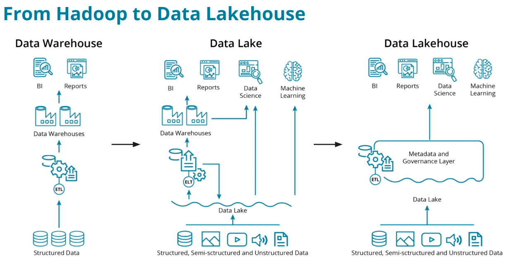

# Introduction to Big Data Ecosystem

Early efforts at processing large amounts of structured, semi-structured, and unstructured data led to the development of Hadoop. Hadoop incorporates two key components:

- The Hadoop Distributed File System (or HDFS) provides distributed storage with high-throughput access to data.

- MapReduce provides a way to conduct massive parallel processing for large amounts of data.
The next step in the evolution was Apache Spark.

Spark built on the ideas of Hadoop and provided multiple programming APIs for processing data as well as providing an interactive interface for iteratively developing data engineering and data science solutions.

Hadoop and Spark have led to the development and popularity of data lakes to process large amounts of both structured and unstructured data.

Finally, the latest step in the evolution of big data ecosystems is the lake house architecture. Lake house seeks to combine the strengths of both data lakes and data warehouses.

# From Hadoop to Lakehouse Architecture

Data warehouses are based on specific and explicit data structures that allow for highly performant business intelligence and analytics but they do not perform well with unstructured data.

Data lakes are capable of ingesting massive amounts of both structured and unstructured data with Hadoop and Spark providing processing on top of these datasets.

Data lakes have several shortcomings that grew out of their flexibility. They are unable to support transactions and perform poorly with changing datasets. Data governance became difficult due to the unstructured nature of these systems.

Modern lakehouse architectures seek to combine the strengths of data warehouses and data lakes into a single, powerful architecture.

# The Hadoop Ecosystem

### Hadoop Vocabulary

- Hadoop - an ecosystem of tools for big data storage and data analysis. Hadoop is an older system than Spark but is still used by many companies. The major difference between Spark and Hadoop is how they use memory. Hadoop writes intermediate results to disk whereas Spark tries to keep data in memory whenever possible. This makes Spark faster for many use cases.

- Hadoop MapReduce - a system for processing and analyzing large data sets in parallel.

- Hadoop YARN - a resource manager that schedules jobs across a cluster. The manager keeps track of what computer resources are available and then assigns those resources to specific tasks.

- Hadoop Distributed File System (HDFS) - a big data storage system that splits data into chunks and stores the chunks across a cluster of computers.

As Hadoop matured, other tools were developed to make Hadoop easier to work with. These tools included:

- Apache Pig - a SQL-like language that runs on top of Hadoop MapReduce
- Apache Hive - another SQL-like interface that runs on top of Hadoop MapReduce

# How is Spark related to Hadoop?

Spark, which is the main focus of this course, is another big data framework. Spark contains libraries for data analysis, machine learning, graph analysis, and streaming live data. Spark is generally faster than Hadoop. This is because Hadoop writes intermediate results to disk whereas Spark tries to keep intermediate results in memory whenever possible.

The Hadoop ecosystem includes a distributed file storage system called HDFS (Hadoop Distributed File System). Spark, on the other hand, does not include a file storage system. You can use Spark on top of HDFS but you do not have to. Spark can read in data from other sources as well.

# MapReduce

MapReduce is a programming technique for manipulating large data sets. "Hadoop MapReduce" is a specific implementation of this programming technique.

The technique works by first dividing up a large dataset and distributing the data across a cluster. In the map step, each data is analyzed and converted into a (key, value) pair. Then these key-value pairs are shuffled across the cluster so that all keys are on the same machine. In the reduce step, the values with the same keys are combined together.

While Spark doesn't implement MapReduce, you can write Spark programs that behave in a similar way to the map-reduce paradigm. In the next section, you will run through a code example.

