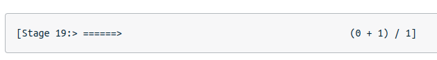

# The Spark DAG: Teamwork for Data Processing

### The Spark DAG

Apache Spark distributes data processing tasks over a cluster of distributed computing resources. How does it accomplish this?

### Cycling Team

Imagine a team of road cyclists, who share their water with each other to reduce the load of the person cycling in the front. Each time the lead cyclist rotates to the back, they take the duty of carrying the new lead cyclist's water. This works great, until they become separated.

If the lead cyclist is separated from their team, they won't have any water. For the lead cyclist to have adequate water, they must carry their own water. Similarly, in distributed systems, your program shouldn't rely on resources created by previous executions.

An idempotent program can run multiple times without any effect on the result. Some programs depend on prior state in order to execute properly. This is not considered idempotent, because they depend on that state existing before starting.

### Dividing the Work

One goal of idempotent code is that data can be processed in parallel, or simultaneously. This is done by calling the same code repeatedly in different threads, and on different nodes or servers for each chunk or block of data. If each program has no reliance on prior execution, there should be no problem splitting up processing.

When writing Spark code, it is very important to avoid reading data into regular lists or arrays, because the amount of data your code deals with can be very large. Instead, you will use special datasets called Resilient Distributed Datasets (RDDs) and DataFrames. Much like an SQL query cursor, they don't actually hold all of the data in memory. These datasets give your Spark job access to the shared resources of the cluster in a very controlled way, that is managed outside of your Spark job.

# Directed Acyclic Graph (DAG)

Similar to how cyclists carry their own water, every Spark program makes a copy of its input data and never changes the original parent data. Because Spark doesn't change or mutate the input data, it's known as immutable. But what happens when you have lots of function calls in your program?

- In Spark, you do this by chaining together multiple function calls that each accomplish a small chunk of the work.

- It may appear in your code that every step will run sequentially

- However, they may be run more efficiently if Spark finds a more optimal execution plan

Spark uses a programming concept called lazy evaluation. Before Spark does anything with the data in your program, it first builds step-by-step directions of what functions and data it will need.

In Spark, and in other similar computational processes, this is called a Directed Acyclic Graph (DAG). The reference is made to the fact that no explicit repetition is inherent in the process. For example, if a specific file is read more than once in your code, Spark will only read it one time. Spark builds the DAG from your code, and checks if it can procrastinate, waiting until the last possible moment to get the data.

A cycling team rotates their position in shifts to preserve energy. In Spark, these shifts are called stages.As you watch the output of your Spark code, you will see output similar to this:

This means your code is on stage 19 of its physical execution plan. Data is processed in parallel tasks at each stage, separated by data partitions, so data in the same partition can be processed more efficiently.

## [Spark Cluster Overview](https://spark.apache.org/docs/3.0.2/cluster-overview.html)

